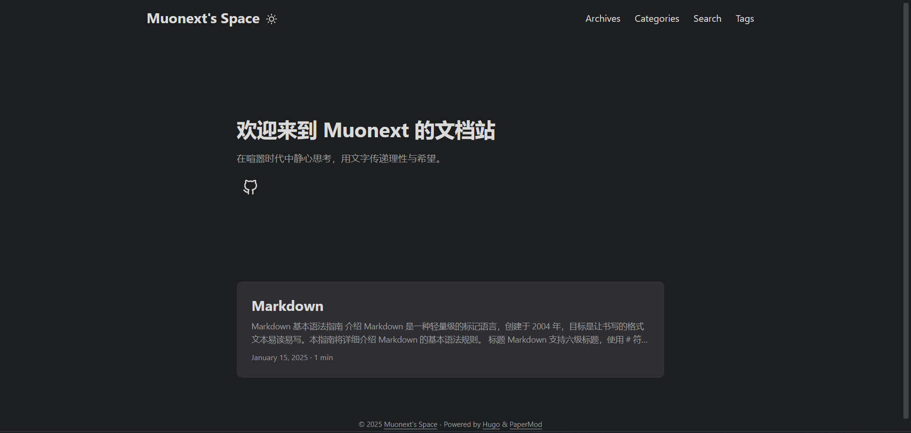
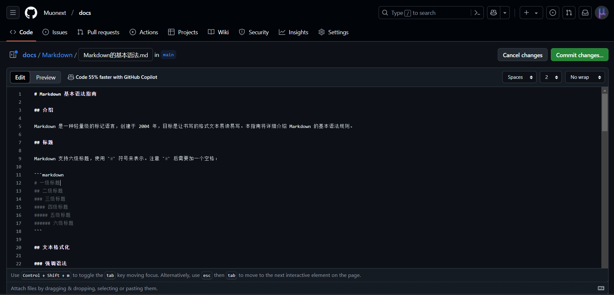
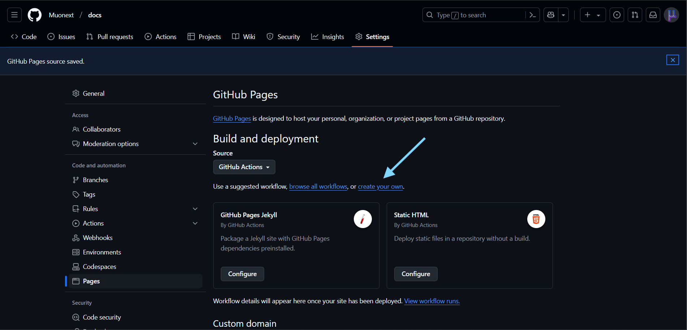
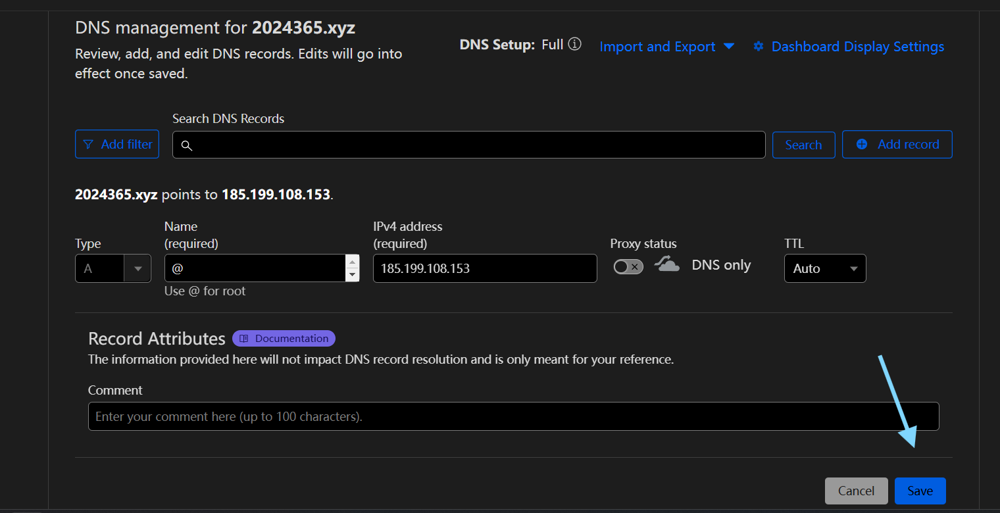
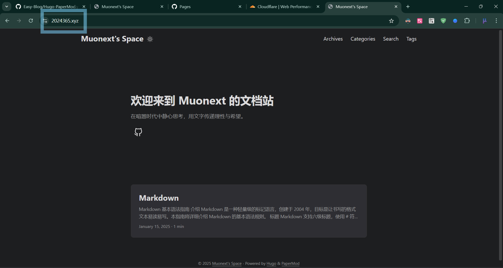

# Easy-Blog
## 先看效果：[**DEMO**](https://2024365.xyz/)

**干干净净，简简单单**

---
这个方案的核心价值是：

- 降低门槛：任何人都可以快速开始
- 节省时间：避免在配置上浪费时间
- 保持专注：把精力放在内容创作上
> **“最好的工具是你意识不到它的存在的工具。”**

这个方案就是为此而设计：让你专注于写作，而不是工具配置。开始使用只需要：

1. 复制工作流文件  
2. 新建 Markdown 文件  
3. 开始写作  

就是这么简单。

虽然默认配置简单，但保留了扩展空间：

- 可以自定义主题样式
- 支持添加评论系统
- 已集成搜索功能
- 支持自定义域名

---

## 一、准备工作
### 创建 GitHub 账号
- 访问 GitHub 注册账号  
- 完成邮箱验证

    **恕不赘述**
### 创建新仓库
- 点击右上角 “+” > “New repository”  
- 仓库名称设置为: docs（或其他你喜欢的名字）  
- 勾选 “Add a README.md”  
- 点击 “Create repository”


## 二、添加文档
### 创建文档目录
- 在仓库根目录创建你想要的文件夹结构
- 例如：技术文档/、笔记/ 等

### 添加文档文件
- 将 Markdown 文件放入相应目录


示例结构：
```plaintext
Articles/
├── README.md
├── 技术文档/
│   ├── README.md
│   ├── 01-安装.md
│   └── 02-配置.md
└── 笔记/
    ├── README.md
    ├── 01-生活.md
    └── 02-学习.md
```

## 三、配置 GitHub Pages
### 进入仓库设置
- 点击仓库顶部的 “Settings” 标签  
- 左侧边栏找到 “Pages”

### 配置发布源
- 在 “Build and deployment” 下  
- Source 选择 “GitHub Actions”
- 点击蓝色小字 “Create Your Own”


### 配置工作流
- 打开 [我写好的 Github Action](https://github.com/Protomyst/Easy-Blog/blob/main/Hugo-PaperMod.yml)
- 复制全部内容到你自己的Github Action的文件编辑器，将文件命名为 `Hugo-PaperMod.yml`
- 点击 "Commit changes..." 保存工作流，将会自动触发部署
- 等待部署完成后访问：https://[你的用户名].github.io/[你的仓库名]，即可看到文档网站


【注】：配置完成后，每次推送更改都会自动触发部署。

## 四、维护和更新
### 添加新文档
- 直接在 GitHub 网页上添加或编辑文件
- 或在本地编辑后推送到 GitHub

### 注意事项
- 文件命名
  文件名称即为网站文章的标题  
- 图片处理
  推荐在 markdown 中使用图床  
- 主题定制
  可以修改 config.toml 中配置，或调整 layouts/index.html 样式
- README.md
  仓库所有的 README.md 均不会显示在网站上（你可以手动取消这一限制）
- 页面标题和描述
  可以在复制的 Github Action 中修改 title(88,106行) 和 Content(107行) 的内容


## 常见问题
- 部署失败
  检查仓库权限设置，查看 Actions 日志  
- 页面不更新
  等待几分钟后刷新（请一定尝试**使用无痕模式访问**），重新手动部署或检查文件是否正确提交  

## 五、配置自定义域名（可选）
### 前提条件
- 已按前面教程部署文档网站
- 拥有可用域名
- 能访问域名的 DNS 设置

### 配置步骤
1. GitHub 仓库设置
   - 仓库 > Settings > Pages > “Custom domain”  
   - 输入想要的域名并保存
3. DNS 配置（任选一种）
   - 方法一：CNAME 记录
     - 类型：CNAME
     - 主机记录：docs(或其他你喜欢的名字,要与上面自定义的二级域名一致)
     - 记录值：[你的Github用户名].github.io
   - 方法二：A 记录
     - 类型：A
     - 主机记录：docs
     - 记录值：185.199.108.153
   - 【注】Cloudflare 用户请不要开启 CDN 功能（小黄云）
  
4. 等待 DNS 生效
    - 一般 1-2 小时
5. 启用 HTTPS  
   - 等证书签发后，选中“Enforce HTTPS” 复选框（否则浏览器会提示不安全）

---

# 让我们一起共建有料的网站吧！